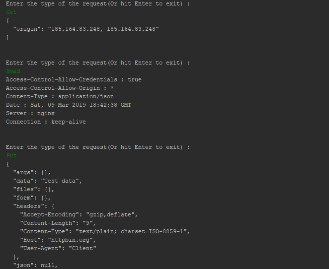

# Course: *Network Programming*
------
# Topic: *Http Client App*
------
## Objectives :
__1. Study the Http protocol and its usage in Web communication;__

__2. Find out about the Java components responsible for implementing Http methods;__

__3. Create a client app which supports the main Http methods using [httpbin.org](httpbin.org);__

## Theory :

### Http Overview

Hypertext Transfer Protocol (HTTP) is an application-layer protocol for transmitting hypermedia documents, such as HTML. It was designed for communication between web browsers and web servers, but it can also be used for other purposes. 

HTTP follows a classical client-server model, with a client opening a connection to make a request, then waiting until it receives a response. 

### Http Main Methods : 

**1. GET** - Request a resource which will be packed according to MIME convenion; 

**2. HEAD** - Request only the headers of the resource;

**3. POST** - Send to the server data to be attached to an indicated resource;

**4. PUT** - Send to the server data to be stored;

**5. PATCH** - Partially modify the resource with the sent data;

**6. DELETE** - Request the deletion of the resource;

## Implementation :

To implement the app I've use Apache Maven, a build automation tool which also gave me the template of the project. The file which conducts the project structure, dependencies and other goods is named _**pom.xml**_. In this file at dependencies I've included the following block : 

```
<dependency>
    <groupId>org.apache.httpcomponents</groupId>
    <artifactId>httpclient</artifactId>
    <version>4.5.6</version>
</dependency>
```

This package gives me many classes with which I could implement the http methods.

The project consists of 3 classes. I have the _**App.java**_ in which is the main class. In it I have the loop for user input : 
```
while (true) {
    BufferedReader reader = new BufferedReader(new InputStreamReader(System.in));
    System.out.println("\nEnter the type of the request(Or hit Enter to exit) : ");
    String request = reader.readLine();
    if (request.length() == 0) {
        break;
    }
    Dispatcher.makeRequest(request);
}
```

From it I call the static method _**makeRequest(String type)**_. With it I dispatch the control depending of the type of the method, to the coresponding method in _**HttpClient**_ class where I have the methods implemented. For example _**HEAD**_ method is implemented in the following way : 
```
void httpHead() {
    try {
        CloseableHttpClient client = HttpClientBuilder.create().build();
        HttpHead headRequest = new HttpHead("http://httpbin.org/ip");
        HttpResponse response = client.execute(headRequest);
        printHeaders(response);
    } catch (Exception e) {
        e.printStackTrace();
    }
}
```

I use the _**CloseableHttpClient**_ class to execute the request stored in _**headRequest**_ variable. After I use a method to print the response. 

## Screenshot


