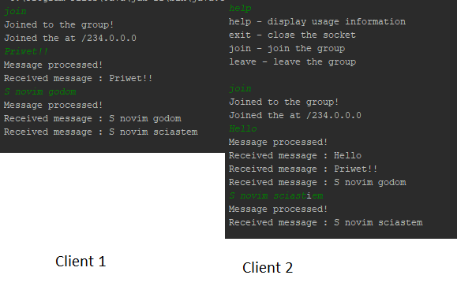

# Course: *Network Programming*
------
# Topic: *UDP Multicast App*
------
## Objectives :
1. Get familiar with UDP Sockets API of the chosen language;

2. Develop a simple multicast app;

## Theory :

UDP (User Datagram Protocol) is an alternative communication protocol to Transmission Control Protocol (TCP) used primarily for establishing low-latency and loss-tolerating connections between applications on the internet.

Both UDP and TCP run on top of the Internet Protocol (IP) and are sometimes referred to as UDP/IP or TCP/IP. But there are important differences between the two.

Where UDP enables process-to-process communication, TCP supports host-to-host communication. TCP sends individual packets and is considered a reliable transport medium; UDP sends messages, called datagrams, and is considered a best-effort mode of communications.

In addition, where TCP provides error and flow control, no such mechanisms are supported in UDP. UDP is considered a connectionless protocol because it doesn't require a virtual circuit to be established before any data transfer occurs.

Java uses MulticastSocket class to create UDP multicast sockets to receive datagram packets sent to a multicast IP address.

A multicast socket is based on a group membership. After creating and bounding a multicast socket, we can join it to the multicast group and any datagram packet sent to the group will be received by the socket as well.

In IPv4, any IP address in the range 224.0.0.0 to 239.255.255.255 can be used as a multicast address to send a datagram packet.

The IP address 224.0.0.0 is reserved and you shouldn't be used in an application.
  
## App structure overview :

1. **Client** - The class responsible for receiving the command, processing it and making the necessary changes, also at the end it returns the response. Its fields include the following : 

~~~
static final String host = "234.0.0.0";    // The IP address used as multicast address
static final int port = 8888;              // The used port
private static DatagramSocket socket;      // Instance of the UDP socket
private static Receiver receiver;          // Instance of the receiver thread
~~~

Then, I have the constructor where I initialize the socket and a boolean function which tells me if the socket is closed or not : 

~~~
Client() throws SocketException {
        socket = new DatagramSocket();
}

boolean closed(){
    return socket.isClosed();
}
~~~

The requests are processed in execute method :

~~~
 String execute(String command) throws IOException {
    assert command != null;
    if (command.equals("help")) {                                 // Help command 
        return "help - display usage information\n" +
               "exit - close the socket\n" +
               "join - join the group\n" +
               "leave - leave the group\n";
    }
    if (command.equals("exit")) {                                 // Exit command    
        socket.close();
        return "Socket closed!";
    }
    if (command.equals("join")) {                                 // Join command to join the multicast group
        if (receiver == null || !receiver.isAlive()) {
            receiver = new Receiver();
            receiver.start();
            return "Joined to the group!";
        } else {
            return "You are already in a group!";
        }
    }
    byte[] msg = command.getBytes();                              // Get byte array from the command   
    DatagramPacket packet = new DatagramPacket(msg, msg.length, InetAddress.getByName(host), port);
    socket.send(packet);                                          // Send the packet to the subscribers
    return "Message processed!";
}
~~~

2. **Server** - The class which makes the connection for the server. It creates a socket on the associated port,
after it listens for packets which then it sends back to the clients : 

~~~
DatagramSocket socket = new DatagramSocket(port);
System.out.println("Started server on port " + port);

while (true) {
    DatagramPacket packet = new DatagramPacket(bytes, bytes.length);
    socket.receive(packet);
    InetAddress address = packet.getAddress();
    int port = packet.getPort();
    packet = new DatagramPacket(bytes, bytes.length, address, port);
    String received = new String(packet.getData(), 0, packet.getLength());
    socket.send(packet);
    System.out.println("Received : " + received);

    if (received.equals("exit")) {
        break;
    }
}

socket.close();
~~~

3. **Receiver** - A class which extends Thread class and it is the blueprint of the thread which receives
the messages for a specific client. It is done in the method run : 

~~~
MulticastSocket socket = new MulticastSocket(Client.port);
InetAddress inetAddress = InetAddress.getByName(Client.host);
socket.joinGroup(inetAddress);
System.out.println("Joined the at " + inetAddress);

while(true) {
    DatagramPacket packet = new DatagramPacket(bytes, bytes.length);
    socket.receive(packet);
    String received = new String(packet.getData(), 0, packet.getLength());
    System.out.println("Received message : " + received);
    if (received.equals("leave")) {
        break;
    }
}

System.out.println("Left group!");
socket.leaveGroup(inetAddress);
socket.close();
~~~

At the beginning of the method the client joins the group and leaveas when the message 
leave was introduced.

4. **User** - A class used for testing purposes. In it I create a client instance.
Then I read the introduced commands and send them to the execute method : 

~~~
Client client = new Client();
BufferedReader bufferedReader = new BufferedReader(new InputStreamReader(System.in));

while(client.closed()){
    String lineInput = bufferedReader.readLine();
    String answer = client.execute(lineInput);
    System.out.println(answer);
}
~~~

## Screenshot

